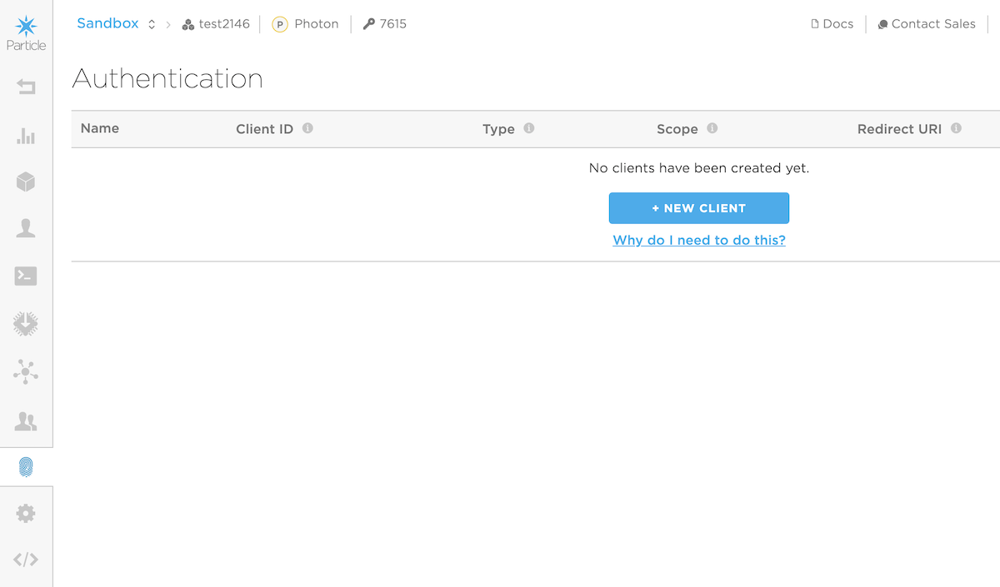
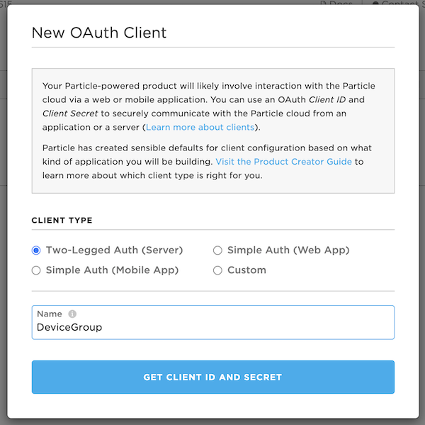
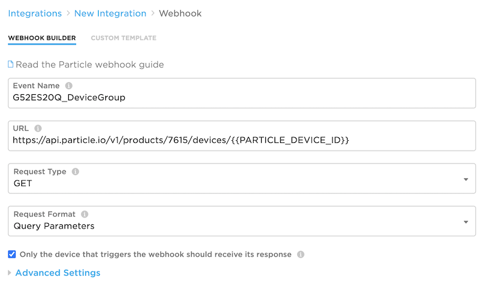
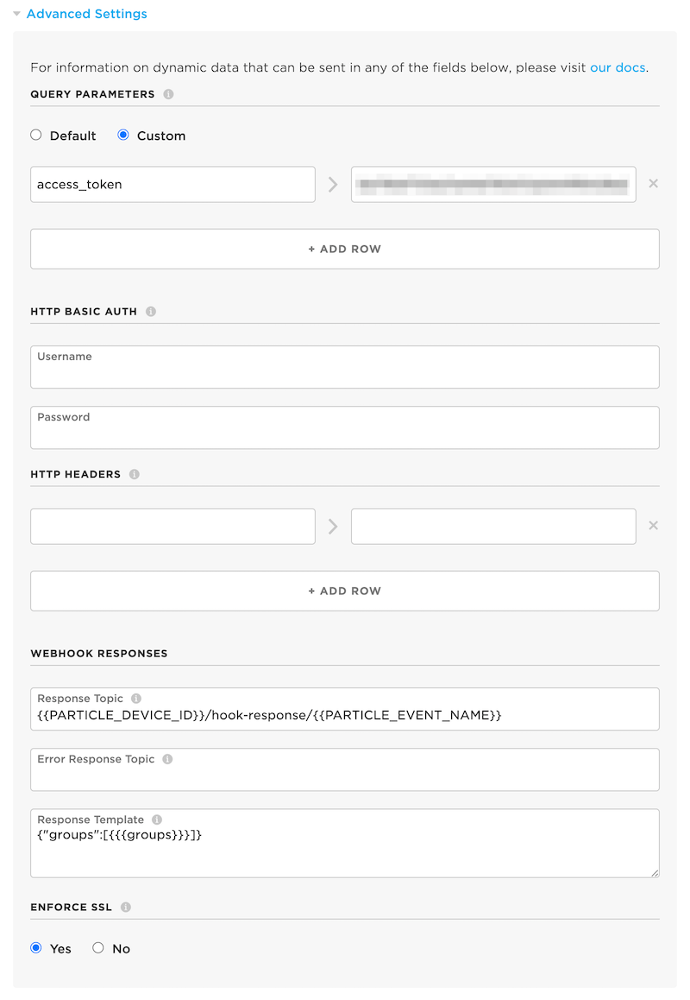

# DeviceGroupHelperRK

**Retrieve a device's device group from the device using a webhook**

- Github repository: [https://github.com/rickkas7/DeviceGroupHelperRK](https://github.com/rickkas7/DeviceGroupHelperRK)
- License: MIT (Can use in open or closed-source projects, including commercial projects. Attribution not required.)
- [Full API documentation](https://rickkas7.github.io/DeviceGroupHelperRK/index.html)

This is useful when you have a product and are using the device groups feature. Normally, use
this to group related devices and control firmware releases. However, you can use this technique
to read the device groups on-device, which would allow you to make decisions in device firmware
based on group membership.

- You can choose when to update groups (manually, at startup, or periodically).
- You can then either query whether the device is in a specific group using the previously cached
group list. This is fast and does not require network access so you can use it in your code liberally.
- Or, if you prefer, you can register a notification function that will call your function with
an indication that the list was updated, and when individual groups are added or removed from the
previous retrieval.


## Requirements

- This is only useful for product devices, as developer devices do not have device groups.

- Because the device needs to subscribe to an event, the device must be claimed to an account. It can be a single account used for all devices, but it must be claimed. Unclaimed devices cannot subscribe to events.

- A webhook is required, described below. The webhook needs to have a product access token in it.

- Retrieving the group list will require at least two data operations (request and webhook response).


## Getting an access token

Since you probably will want a product access token (that allows access to a specific product only) and also a non-expiring one, you will probably want to use an oAuth client and the command line to generate one.

- In your product, open the **Authentication** tab. Make sure you've selected the one in your product, not in your developer account.



- Use the **New Client** button to create a new oAuth client. Select **Two-Legged Auth (Server)**. The Name is just for identifying it in the console, I entered **DeviceGroup**.



- Note the Client ID and Client Secret in the next screen. You'll need them in the next step.

- Use the Particle APU to create a non-expiring product bearer token:

```sh
curl https://api.particle.io/oauth/token -u "devicegroup-5835:3138afffffffffffffffffffffffffffffff7528" -d grant_type=client_credentials -d expires_in=0
```

  - Replace `devicegroup-5835` with the Client ID you just created
  - Replace `3138afffffffffffffffffffffffffffffff7528` with the Client Secret

You should get back something like:

```json
{"token_type":"bearer","access_token":"0a795effffffffffffffffffffffffffffff8b5b","expires_in":0}
```

  - Note the access_token `0a795effffffffffffffffffffffffffffff8b5b`, you'll need that in the next step.

## Creating the webhook

- In the **Integrations** tab for your product, create a new Webhook.

- Set the **Event Name** to be the event name you've configured in the library. The default is `G52ES20Q_DeviceGroup`. You do not need to change it from the default.

- Set the **URL**. Be sure to change 7615 to the product ID of your product!

```
https://api.particle.io/v1/products/7615/devices/{{PARTICLE_DEVICE_ID}}
```

- Change **Request Type** to **GET**. 

- The **Request Format** should change the **Query Parameters** which is correct.

- The checkbox **Only the device that triggers the webhook should receive its response** should be checked.

- Click the disclosure triangle to expand the **Advanced Settings**.



- In the **Query Parameters** select **Custom** and add `access_token` (case-sensitive, and note the underscore) and the value is what you got in the access_token field of the curl response.

- Leave the *HTTP Basic Auth** and **HTTP Headers** fields empty.

- The **Response Topic** should already be `{{PARTICLE_DEVICE_ID}}/hook-response/{{PARTICLE_EVENT_NAME}}` and you can leave it set to that.

- Edit the **Response Template** to be as follows. Be careful with the square and curly brackets; they must be exactly as shown.

```
{"groups":[{{{groups}}}]}
```

- In version 0.0.2, there are other fields you can add to the response template:

```
{"groups":[{{{groups}}}],"name":"{{{name}}}","product_id":{{product_id}},"development":{{development}},"notes":"{{{notes}}}"}
```

You can also include a subset of these fields if you prefer. This can save data and is useful if you have very long device notes that would exceed the size of the publish with the other fields.

```
{"groups":[{{{groups}}}],"product_id":{{product_id}}}
```




## Device firmware

This is the code in the examples/1-simple directory:

```cpp
#include "DeviceGroupHelperRK.h"

SerialLogHandler logHandler(LOG_LEVEL_TRACE);

SYSTEM_THREAD(ENABLED);

PRODUCT_ID(7615);   // Change this to your product ID!
PRODUCT_VERSION(1);


void setup() {
    DeviceGroupHelper::instance()
        .withRetrievalModeAtStart()
        .setup();   
}

void loop() {
    DeviceGroupHelper::instance().loop();

    if (DeviceGroupHelper::instance().isInGroup("dev")) {
        static bool notified = false;
        if (!notified) {
            Log.info("is in group dev!");
            notified = true;
        }
    }
}

```

### Digging in

You need to include the library, such as by using the **Particle: Install Library** function in Particle Workbench or search the community libraries in the Web IDE for **DeviceGroupHelperRK**. Then you can include the header file

```cpp
#include "DeviceGroupHelperRK.h"
```

This library is only useful for products, so you must update the `PRODUCT_ID` macro to match your product.

```cpp
PRODUCT_ID(7615);   // Change this to your product ID!
PRODUCT_VERSION(1);
```

You must initialize the library in `setup()`! The following configuration retrieves the device groups at startup once connected to the cloud.

```cpp
void setup() {
    DeviceGroupHelper::instance()
        .withRetrievalModeAtStart()
        .setup();   
}
```

Make sure you also call `DeviceGroupHelper::instance().loop()` from global `loop()`! If you don't call the setup and loop methods, the library will not work properly. You should call the loop frequently, preferably on every loop. It returns quickly if it does not have anything to do.

```cpp
void loop() {
    DeviceGroupHelper::instance().loop();
    // ...
```

This code checks to see if the device belongs to a specific group and logs it if it is (once). You'd probably want to do something more useful here. `isInGroup()` is fast and efficient and you can call it frequently. It uses the previously retrieved value and does not access the network.

```cpp
    if (DeviceGroupHelper::instance().isInGroup("dev")) {
        static bool notified = false;
        if (!notified) {
            Log.info("is in group dev!");
            notified = true;
        }
    }
```


### With callback

Alternatively, you can register a callback to be notified when group membership changes. This checks every 5 minutes for groups. You probably don't want to do it that frequently in real life.

```cpp
void setup() {
    DeviceGroupHelper::instance()
        .withRetrievalModePeriodic(5min)
        .withNotifyCallback(groupCallback)
        .setup();   
}
```

The groupCallbacks function in examples/2-notify looks like this. It only logs messages; you probably want to do something more useful here.

```cpp
void groupCallback(DeviceGroupHelper::NotificationType notificationType, const char *group) {
    switch(notificationType) {
    case DeviceGroupHelper::NotificationType::UPDATED:
        Log.info("updated groups");
        break;

    case DeviceGroupHelper::NotificationType::ADDED:
        Log.info("added %s", group);
        break;

    case DeviceGroupHelper::NotificationType::REMOVED:
        Log.info("removed %s", group);
        break;
    }
}
```

You can respond to the `UPDATED` notification if you want to know if the list has been refreshed.

You can also use the `ADDED` or `REMOVED` notification to know if the group membership changed. You also get `ADDED` calls on the first retrieval of the list.

### Other fields

If you add other fields to your webhook, you can also use the accessors:

```
const char *getDeviceName() { return name; };

int getProductId() const { return product_id; };

String getDeviceNotes() const { return notes; };

bool getIsDevelopment() const { return development; };
```

These will return the values sent by the webhook response if you've included them in the response template.

See example 3-extra-fields for more information.

## Version History

### 0.0.2 (2021-08-20)

- Added optional feature to include the name, notes, development flag, and product_id

### 0.0.1 (2021-03-22)

- Initial version
